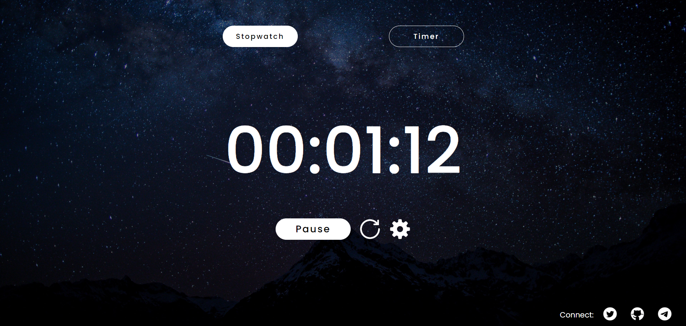
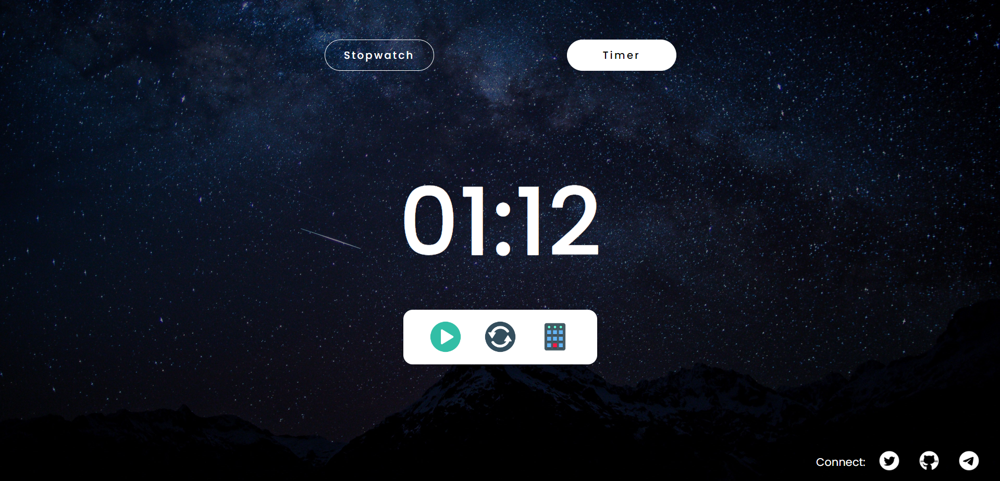

# Stopwatch and Countdown Timer App ⏱️🕰️

## Overview 🌟

The Stopwatch and Countdown Timer app is a versatile web application that offers two essential functionalities: a Stopwatch and a Countdown Timer. This app is designed to help you track elapsed time and set custom countdowns, ensuring accurate time management for various tasks and activities. Developed using HTML, CSS, and JavaScript, the app provides a smooth and user-friendly experience.

## Features 🚀

- ⏱️ Stopwatch: Measure elapsed time with a start/pause button and a reset button. The Stopwatch maintains continuity even if the page is refreshed, ensuring accurate tracking.

- ⏳ Countdown Timer: Set custom countdowns in hh:mm:ss, mm:ss, or ss format using the "Set Timer" button. The app offers user-friendly input validation to prevent errors. Start, pause, and reset functionalities are available, and just like the Stopwatch, the Countdown Timer continues running accurately even after page refresh or closure.

- 💾 Local Storage: The app utilizes local storage and timestamps to save and restore progress, ensuring that the Stopwatch and Countdown Timer retain their state, even in the event of a page refresh or closure.

## Screenshots 📸

*Screenshot of the Stopwatch in action, measuring elapsed time.*

*Screenshot of the Countdown Timer, ready to start a custom countdown.*

## How to Use 📖

1. **Switch Between Stopwatch and Countdown Timer:** Click the "Stopwatch" or "Timer" option to switch between the Stopwatch and Countdown Timer functionalities.

2. **Stopwatch:**
   - Click the "Start" button to begin the Stopwatch. Click it again to pause.
   - Click the "Reset" button to reset the Stopwatch to zero.

3. **Countdown Timer:**
   - Click the third button to set a custom countdown time in hh:mm:ss, mm:ss, or ss format. Ensure valid input.
   - Click the "Start" button to begin the countdown. Click it again to pause.
   - Click the "Reset" button to reset the countdown.

4. **Continuity on Refresh:** No worries about losing progress! The app resumes accurately as if it was never closed and running in the background, thanks to local storage and timestamps.

## Important Notes ⚠️

- To ensure proper functionality, host the app on a live server or localhost. Simply opening the index file as a web page won't provide the required features.
- When setting the countdown timer, enter the time in the correct format: hh:mm:ss, mm:ss, or ss. Invalid inputs will prompt an error.

## Feedback and Support 💌

I hope you find this Stopwatch and Countdown Timer app useful for managing your time effectively. If you have any feedback, suggestions, or encounter any issues, please feel free to reach out to me at azimbaji19@gmail.com .

Enjoy tracking time with precision! 🎯🚀
